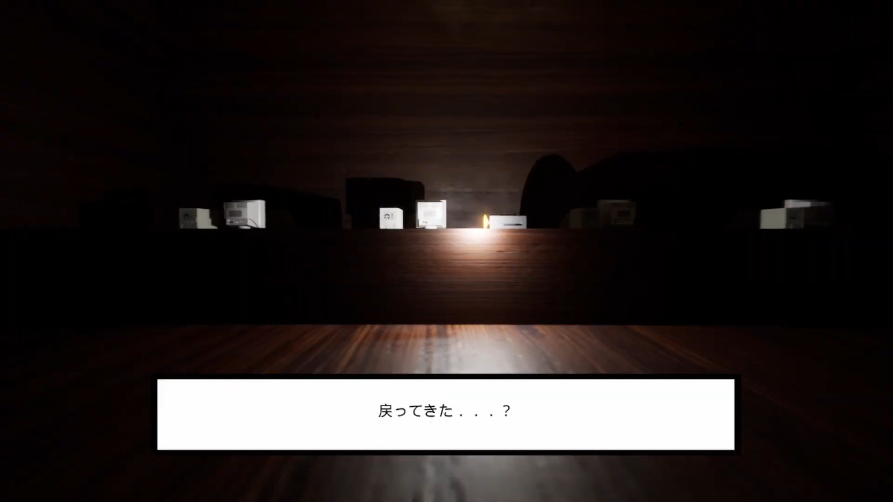
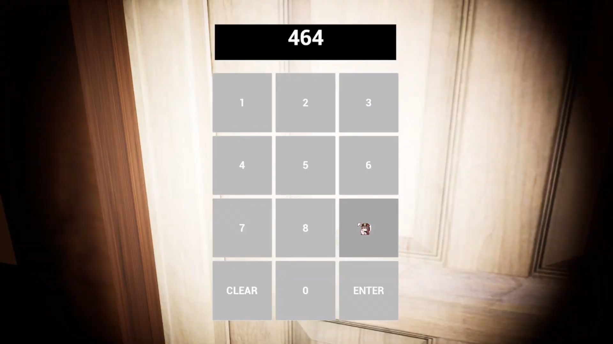
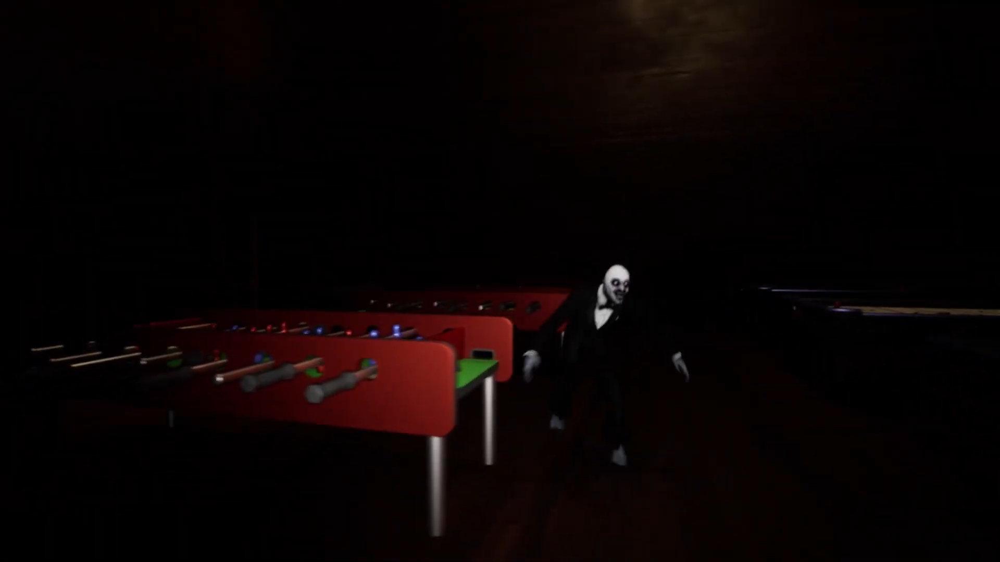

**プロジェクト名**
脱出できるもんなら脱出してみなさい

## 概要
Unreal Engineで制作したFPSホラー探索ゲーム。プレイヤーは暗い屋敷を探索し、敵に追われながら鍵を集め、脱出を目指します。

## 開発背景
学校の課題として制作し、クラス最優秀賞を獲得しました。その後「ゲームクリエイター甲子園2024」に作品を提出しました。敵AIや探索ギミックの実装を通じて、Unreal EngineとBlueprintの基礎を学びました。

## スクリーンショット

 　


## 使用技術
- Unreal Engine
- Blueprint

## 工夫した点・学んだこと
- 敵AIに「巡回」「追跡」を実装し、プレイヤーの行動に応じた緊張感あるゲーム体験を演出
- Blueprintを用いてタイトル画面・ゲームオーバー画面を実装し、作品としての完成度を向上
- 鍵アイテムや暗証番号による扉のギミックを追加し、探索要素と謎解き要素を両立

## 主な機能
- キャラクターの移動
- 敵AIの動き
- アイテムの回収

## 実行方法
```bash
Unreal Engine で開き、実行してください。
